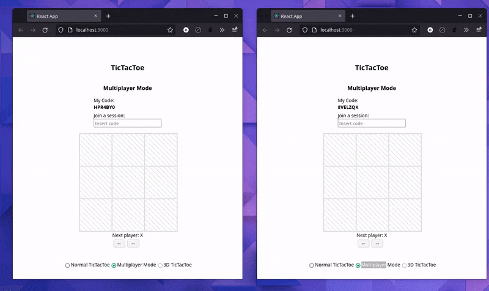

# 🎮 React TicTacToe multiplayer real-time
Full-stack personal project made for learning about websockets and a little bit of React 🙂

<div align="center">

</div>

### Overview
#### Server
- Express
- Socket IO
#### Client
- React App

---

### First steps
#### Install all dependencies needed 
```bash
make install
```
### Go live
#### Start the server
```bash
make serve
```
_Will start listening at port `2000`_

#### Start client
In another terminal...

```bash
make start-client
```
_Will start frontend app in port `3000`_
